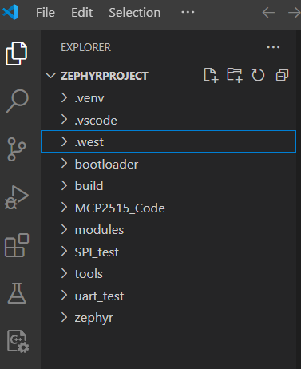
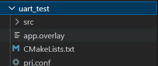

# Zephyr RTOS

## Basics

### 1. VSCode workspace

Open the zephyrproject folder (the folder where the virtual environment is created) in VSCode.

### 2. Creating a new Zephyr project (inside the west workspace)

Note: Projects can also be created outside of the west workspace. [Refer to this for adding project outside workspace](https://docs.zephyrproject.org/latest/develop/application/index.html)

Create a folder with suitable project name (under zephyrproject folder).
Inside your new project folder, add a "src" folder. That is where your main.c will reside.
Additionally, add "app.overlay" , "CMakeLists.txt" and "prj.conf" files to your project folder.
These are necessary files that should be included in every Zephyr project you create. 

